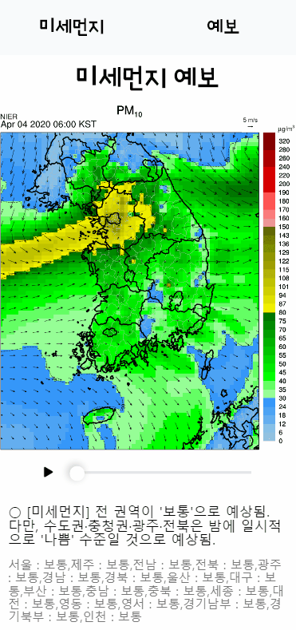
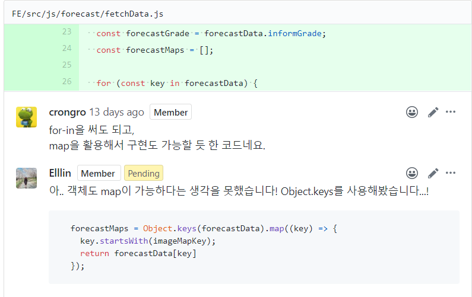
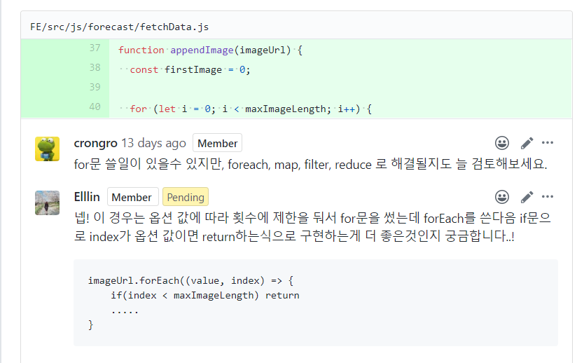
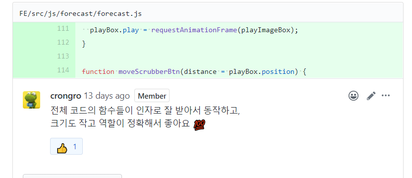

## 개요

- 기간 : 2020-03-23 ~ 2020-03-27
- 인원 : Back-end(1인), Front-end(2인), IOS(1인)
- 담당 : Front-end (forcast)

## 사용 도구 및 기술

- HTML
- CSS
- Javascript (모바일 웹개발, Touch Event, rAF, webpack)

## [미션] 미세먼지정보 페이지 만들기 - 페어로 진행

- forecast 담당

## 기능구현 이미지

## 문제 해결

미세먼지 예보 슬라이드 구현 → 서버에서 오는 예보 이미지가 3장밖에 없는 상황 -> 3장만 적용했더니 슬라이드가 부드럽지 않음 -> 백엔드 개발자에게 이미지를 추가 요청 → 정확한 데이터만 사용하고 싶다는 의견으로 거절 → 이미지의 갯수 여부를 떠나 슬라이드의 부드러운 작동은 프론트 개발자의 능력같아서 데모 전날 코드를 전부 다시 설계 → 작은 기능의 함수로 나눠서 함수를 정의 및 구현 후 함수들을 조합하여 기능 구현 → 더 좋은 코드로 발전 → 문제 해결

이로인해 소통의 방법도 함께 배운 것 같다. 내 생각이 무조건 옳다고 생각하지 말고 상대방의 의견도 옳다고 생각하며 객관적인 입장으로 사건을 바라보고 (객관적인 입장이 되기 힘들다면 다른 사람들의 의견을 들어보는 것이 좋았다.) 그래도 내 생각이 더 좋다고 느껴지면 상대방이 내 생각에 동의할 수 있도록 솔직하고 타당한 이유를 들며 상대방을 충분히 이해시키자
사실 이번 미션에서는 온라인으로 소통하고 진행해서 설득하는 과정과 대화하는 과정에서 어려움을 겪은 것 같지만 이로 인해 정말 많이 배운 것 같다.

## 설계 방법

이번 미션을 통해 느낀 점은 코드를 작성하기 전 함수 역할을 나눌 때 함수가 간단한 역할만 하도록 필요한 기능을 한글로 적어 나가면 좋을 것 같다.
예를 들어 이번 미션에서 이미지를 번갈아 가며 보여줄 때 무작정 기능을 구현했지만

1. 이미지를 움직이는 함수
2. moveScrubber button을 움직이는 함수

이렇게 간단한 기능들로 함수의 기능을 정의하여 작은 단위들로 나눈 뒤 이 함수들을 조합하여 큰 기능들을 완성해 나가는 것이다.
아직 이게 맞나? 하는 의문은 있지만 그래도 미션 하나하나 해나가며 내가 더 성장하고 있다는 것을 느낀다. 나만의 코딩 스타일을 찾아야겠다.

### 잘한 점

- 팀원과 함께 매일 스크럼 하고 계속 소통한 것
- 기능완성 한 것
- 마감 시간 지킨 것
- 오류가 있는지 마지막까지 계속 확인 한 것

### 아쉬운 점

- 시간에 쫒겨서 겨우 완성 한 것
- 공부를 제대로 못하고 기능구현에 급급했던 점
- 코드 리팩토링이 잘 안된 점
- 모바일 최적화에 좀 더 신경쓰지 못한 점
- 브랜치와 커밋에 신경쓰지 못한 점
- 이슈작성을 기능 단위로 세분화 하지 않은 것

중간에 giuhub의 내부 오류가 발생해 이용할 수가 없다는 핑계로 이슈를 하나로 작성하게 된 것 같다. 다른 팀원들의 글 게시수가 월등히 많은 것을 보고 많이 반성했다. 앞으로는 기능별로 잘 나눠서 작성하도록 그리고 커밋도 꼭 잘 하도록 노력해야겠다.
[팀프로젝트 회고](https://docs.google.com/spreadsheets/d/1fJFNi1TQ0JLXc9f8Ty3dngoTvGK8dPKeVfhXwNd2_8k/edit#gid=1950847730)

## issue관리

[기능구현 issue 정리](https://github.com/codesquad-member-2020/dust-10/issues/10)

## 코드리뷰

[코드리뷰](https://github.com/codesquad-member-2020/dust-10/pull/46)

